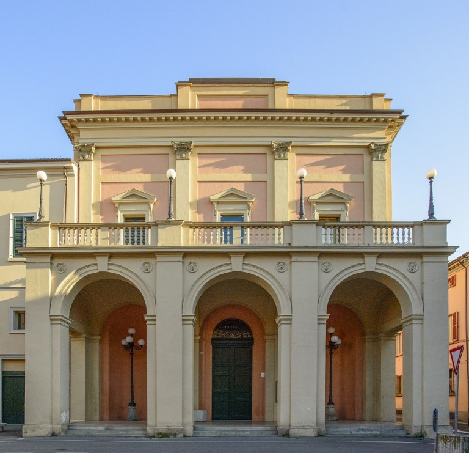

[View on GitHub](https://github.com/KatyaMugai/Teatro-comunale-Ebe-Stignani) | 
[Home](index.md) | 
[Topic](topic.md) | 
[Methodology](methodology.md) | 
[SPARQL & Results](sparql.md) | 
[Identifying Gaps](gaps.md) | 
[LLM Prompts](prompts.md) | 
[RDF Triples](triples.md) | 
[Challenges](challenges.md) | 
[Conclusion](conclusion.md)

---

# Teatro comunale Ebe Stignani

**Enriching Cultural Heritage Knowledge with ArCo and Large Language Models**

This project explores and enriches the representation of the **Teatro comunale Ebe Stignani** (Imola, Italy) in the ArCo / MiBACT Knowledge Graph.

**Main resource analysed:**  
`http://dati.beniculturali.it/mibact/luoghi/resource/CreativeWork/5725_`

## Project Structure

- **Topic** — Description of the theatre and its cultural context
- **Methodology** — How the research was conducted
- **SPARQL & Results** — Queries used to explore the data
- **Identifying Gaps** — The main information gaps found
- **LLM Prompts** — Prompts used with large language models
- **RDF Triples** — Proposed enrichment triples in Turtle
- **Challenges** — Difficulties encountered during the work
- **Conclusion** — Final remarks and outcomes

## Identified Gaps (summary)

1. **No Subject / CulturalProperty classification** — the resource is only typed as `cis:CreativeWork`
2. **No alternative naming captured** — missing common variants such as “Teatro Stignani” and “lo Stignani”
3. **No explicit link to the person it is named after** — missing connection to Ebe Stignani (Wikidata Q456908)

---

*Project by Ekaterina Mugaiskikh · September 2026*

